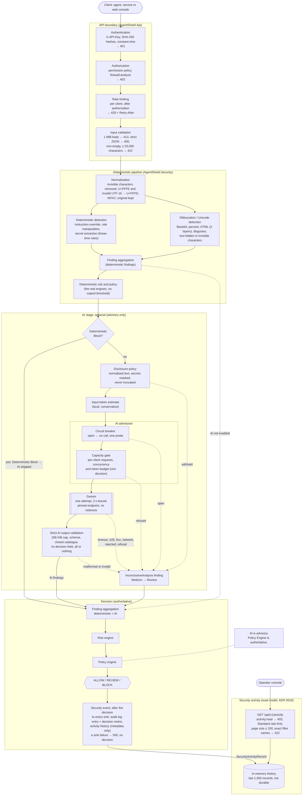
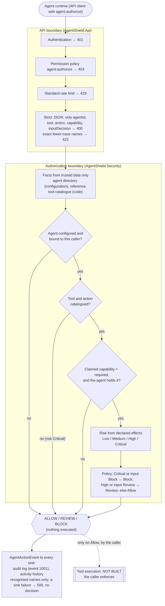
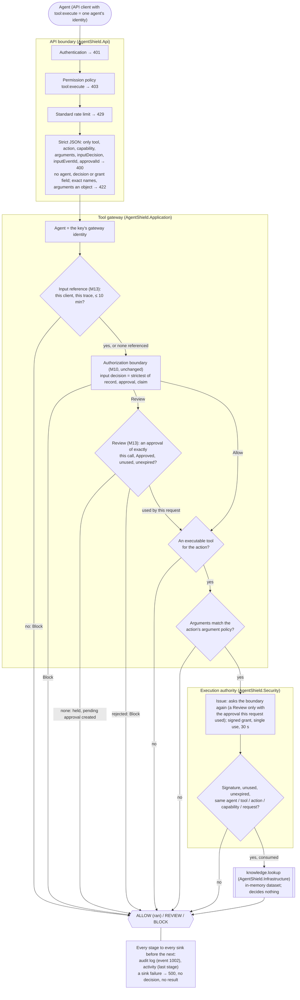

# Security architecture

Every control a request passes, in the order the code applies it (as of 2026-10-07, Milestone 13). **AI is advisory. The policy
engine is authoritative.** The AI stage can only add findings; the deterministic risk and policy engines decide. For agent
actions, **the agent proposes and the authorization boundary decides**; the tool gateway executes its one reference tool
only on Allow, or on a Review a person approved (Milestone 13), and every other tool is the caller's to execute.

Invariants and their evidence: [security-invariants.md](security-invariants.md). Where an attacker can interact:
[attack-surface.md](attack-surface.md). Detection rules: [firewall-pipeline.md](firewall-pipeline.md). AI stage:
[ai-analysis.md](ai-analysis.md). Agent action authorization: [agent-action-authorization.md](agent-action-authorization.md).
Tool gateway: [tool-gateway.md](tool-gateway.md). Attack Lab: [attack-lab.md](attack-lab.md).

## The two decision points

```text
INPUT                          untrusted content (user prompt, document text)
  ↓
INPUT SECURITY                 POST /api/v1/firewall/analyze → Allow / Review / Block        (built)
  ↓
AGENT                          the caller's agent runtime (not AgentShield)
  ↓
ACTION REQUEST                 POST /api/v1/agent/actions/authorize                          (built, M10)
  ↓
CAPABILITY CHECK               configured agent bound to the caller; catalogued tool action;
  ↓                            exactly the required capability, held by the agent
RISK CLASSIFICATION            from the action's declared effects; no AI
  ↓
POLICY                         ordered deterministic rules; the reported input decision only tightens
  ↓
ALLOW / REVIEW / BLOCK         returned, audited, listed in Activity
  ↓
TOOL EXECUTION                 the tool gateway (M11), POST /api/v1/agent/tools/execute, for knowledge.lookup:
                               verified input reference (M13) → same boundary → Review: a person's approval of
                               exactly this call, used once (M13) → argument policy → signed single-use grant →
                               the tool, once; every other tool: the caller's runtime executes, or not
  ↑
HUMAN APPROVAL (M13)           POST /api/v1/agent/approvals/{id}/approve | deny (agent:approve, a separate client)
```

## Request path



## Agent action path (Milestone 10)



Every "no" above is a Block. The agent's request cannot grant a capability (grants come only from configuration), cannot
carry a decision, risk or reasoning (400), and cannot lower a decision: the claimed capability can only match or block,
and the reported input decision can only tighten ([ADR 0020](../decisions/0020-agent-action-authorization-boundary.md),
invariants 44–56).

The activity history is written only from the finished security event and read only by its own endpoint: nothing in it
flows back into an analysis. It keeps the decision, risk, finding codes, a coarse AI status (every failure is
`Incomplete`) and the event's identifiers, never the input, decoded content, rule IDs or provider output
([ADR 0019](../decisions/0019-security-activity-history.md), invariants 39–43).

Before the boundary shown above, every request passes, in this order: correlation ID (validated or generated), request
logging (route template only), the exception handler, status-code pages, security headers, HTTPS redirection and CORS
(`Program.cs`). An unexpected exception in any stage fails the request closed: 500, no decision, no security event, and
the log holds the exception as redacted text.

## Tool gateway path (Milestone 11)



Only the execution authority holds a tool, only the gateway holds the authority, and only the gateway endpoint holds the
gateway ([ADR 0021](../decisions/0021-tool-gateway-enforced-execution.md), invariants 57–70). The agent holds its API key,
which lets it ask; it never holds a grant, a signing key or a reference to a tool.

## Human approval and input binding (Milestone 13)

```text
FIREWALL ANALYSIS ──► security event ──► every sink: audit log, activity, INPUT CONTEXT (event, trace, client, decision)
AGENT ──► gateway call (+ inputEventId) ──► verified ──► boundary ──► Review ──► HELD + pending approval (bound to the call)
PERSON (agent:approve, not an agent's key) ──► approve | deny ──► reserved → recorded (event 1003) → takes effect
AGENT ──► the same call (+ approvalId) ──► boundary again ──► TryUse (atomic, once) ──► arguments ──► grant ──► tool once
```

The approval adds no second execution path: an approved call goes through every gateway stage again, and the execution
authority grants a Review only for the approval this very request used ([tool-gateway.md](tool-gateway.md) sections
16–18, [ADR 0023](../decisions/0023-human-approval-and-input-event-binding.md), invariants 74–81).

## Attack Lab (Milestone 12): demonstration, not a control

The console's Attack Lab sends fixed demonstration requests through the two paths above and shows what came back
([attack-lab.md](attack-lab.md), [ADR 0022](../decisions/0022-attack-lab-demonstration-layer.md)). It adds no control,
endpoint or code path to the API; a demonstration request is an ordinary request.

```text
INPUT SECURITY    scenario input ─► POST /api/v1/firewall/analyze ─► DETECT → SCORE → POLICY ─► Allow / Review / Block
                                                                   (no tool involved: the caller acts on the decision)

AGENT SECURITY    scenario tool call ─► POST /api/v1/agent/tools/execute ─► AUTHORIZE → GATEWAY → EXECUTE
                                        (agent = the Development key's gateway identity, research-agent)
                                        AUTHORIZE: the M10 boundary (capability, risk, policy) → Allow / Review / Block
                                        GATEWAY:   on Allow only: argument policy, single-use grant
                                        EXECUTE:   knowledge.lookup, once, only for a verified, consumed grant;
                                                   every other tool is authorization-only (decided, not run)
```

The console renders the response (decision, stages, findings, identifiers) and nothing else; Activity and the Overview's
security operations counts read the same history any `activity:read` client reads.

## Who decides what

| Component | Decides | Cannot |
|---|---|---|
| Detectors | Findings (category, code, severity) | Decide, skip another detector, put input in a finding |
| AI analyser (Gemini) | Additional findings from a closed catalogue | Decide, remove or lower a deterministic finding, name a decision, reach a log or the response with its own text |
| AI stage | Whether the AI is called (only a deterministic Block may skip it); what a failure means (always Review) | Fall back to the deterministic decision alone when the AI was expected |
| Capacity gate, circuit breaker | Whether a call may start | Turn a refusal into Allow (every refusal is Review) |
| Risk engine | Score and level from all findings | Lower the level when findings are added |
| Policy engine | Allow, Review or Block from the risk | Be overridden by any other component |
| Security-event sinks (audit log, activity history) | What is recorded, after the decision | Change or recompute the decision; let a recording failure return a decision (the analysis fails closed) |
| Agent (through its runtime's request) | Which action it proposes and which capability it claims | Grant itself a capability, name a decision or risk, add reasoning the policy weighs (400), lower a decision |
| Agent directory, tool catalogue | Which agents exist, what each holds and who may act for it; what each action requires and what it does | Change at runtime (built once, immutable) |
| Agent action authorization boundary | Allow, Review or Block for a proposed action, from trusted facts, the action's risk and the reported input decision | Execute anything; allow or review an unknown agent, tool or action; let an input decision loosen the result |
| Agent runtime (the caller) | Whether to execute an action that is not behind the gateway | Be overridden by AgentShield for such a tool: enforcement is the caller's |
| Tool gateway | The order of the stages; Block when no tool runs an allowed action, its arguments break the action's argument policy, the referenced input analysis cannot be verified, or a presented approval does not fit the call | Run a tool itself (it holds none); lift a Block; run a Review without an approval a person gave for exactly this call; let a claim replace a verified input decision; name the agent from the body |
| Person (a client holding `agent:approve`) | Approve or deny a held call, once, before it expires | Lift a Block; approve a call the gateway did not hold; change what the approval binds; outside Development, be an agent's credential |
| Approval store, input context store | Hold the server's record of approvals and analyses, atomically | Decide anything; keep arguments or input content |
| Argument policy | Whether a tool call's arguments match the action's schema | Decide who may call the tool |
| Execution authority | Whether a grant is issued (only for the boundary's Allow, asked again) and whether a presented grant runs its call | Run anything for an altered, made-up, used, expired or mis-addressed grant; run a tool twice for one grant |
| Tool (`knowledge.lookup`) | The result of a lookup | Decide whether it may be called; see raw JSON or the caller |
| Attack Lab (console) | Which demonstration request to send, unchanged, to the firewall or the gateway | Decide, score, authorise or run anything; send a field beyond the contract (400 before a decision); show a scenario's intent as the result; reach a tool except through the gateway |

## Trust boundaries

| Boundary | Untrusted side | Treatment |
|---|---|---|
| Client → API | Body, headers, path, query, key, timing | Authenticated, authorised and rate limited before the body is read; strict parsing; never echoed or logged |
| API → Gemini | The content sent (it may carry an injection aimed at the analyser) | Normalised and masked; framed as an untrusted JSON field; only the pinned endpoint receives it, with no redirects |
| Gemini → API | The whole response, including errors and exceptions the SDK raises | Capped, strictly parsed and validated; exception messages and answer text never logged or returned; any failure → Review |
| Operator → API | Configuration | Trusted but validated at startup: unsafe settings (Development key, rate limiting off, wildcard CORS, a log level hiding security events) stop the API outside Development |
| API → activity reader | Every client's decisions, as metadata | Only `activity:read` clients; documented fields only; query values bounded, matched exactly and never echoed |
| Agent runtime → API | The agent's proposed action: agent, tool, action, claimed capability, reported input decision | Only `agent:authorize` clients; strict contract; exact names; facts from trusted data; the caller from authentication; made-up names never recorded verbatim |
| API → agent runtime | The decision | For tools not behind the gateway, AgentShield cannot see or stop the execution that follows; only Allow means the action may run |
| Agent → tool gateway | The tool call: tool, action, claimed capability, arguments, reported input decision, input reference, approval ID | Only `tool:execute` clients; the agent from the key, never the body; strict contract; an input reference verified against the server's record (client, trace, age); an approval ID only selects a server-held approval, which must fit the call exactly; per-tool argument policy; only the execution authority reaches the tool, for a verified, consumed grant |
| Person → approval endpoints | An approve or deny request for an approval ID | Only `agent:approve` clients (outside Development never an agent credential); no body is read; the decider from authentication; recorded before it takes effect |
| Tool → API | The tool's output | Bounded (`ToolOutput`, 2,000 characters); the reference tool returns dataset text only; never recorded |
| API → console (Attack Lab, Activity, Overview) | Every value in a response | Rendered as text; enumerations looked up by own property and never echoed when unknown; a tool shown as run only when decision, flag and outcome agree; counts shown only as returned |
| API → logs and metrics | — | Route templates, codes, rule IDs, client IDs and numbers only; secrets masked as defence in depth |

## How the architecture is checked

- **Decision core.** The production aggregator, risk engine and policy engine are tested exhaustively against the
  specification: every score, every multiset of up to six severities, and monotonicity (a Block or a Review never becomes
  Allow). See invariants 33–36 in [security invariants](security-invariants.md).
- **Detection stage.** Fixed-seed robustness properties cover random and malformed Unicode, maximum-length input,
  decoders, and stacked obfuscation. Decoding alone never creates a finding. Input containing U+FFFE, which made
  normalisation throw (D-18), is analysed since 2026-10-01, also when a decoder produces it.
- **Activity history.** Unit, HTTP and full-composition tests, plus hand-applied mutants on the sink-failure handling,
  the AI-status reduction and the page-size bound (invariants 39–43).
- **Mutation testing.** Stryker.NET runs on the Security project, the capacity gate and circuit breaker, and
  authentication and rate limiting (ADR 0018). Scores and accepted survivors are in the
  [test coverage summary](test-coverage-summary.md).
- **Tool gateway.** A probe around every executor in every HTTP test, a reflection test over every AgentShield type for
  complete mediation, adversarial grant tests (forgery, tampering, replay, concurrency, expiry, binding) and focused
  Stryker scopes (invariants 57–70).
- **Console.** Vitest component tests, plus browser checks against the real API, run on demand.
- **Attack Lab.** Every scenario's decision pinned through the real pipeline (`AttackLabScenarioTests`), scenario
  fields rejected before a decision, Activity free of payloads, the five workflows and every scenario in a real browser,
  28 hand-applied console mutants (invariants 71–73).

## Not part of this architecture today

Enforcement for tools other than the gateway's reference tool (real tools, MCP), argument policies for them, screening
of tool results, the protected agent's output, multi-turn conversation state and agent memory, inter-agent communication,
an identity provider for users, persistent audit storage (the activity history is in memory and not an audit record), and
state shared between instances (rate limits, capacity, circuit, grants, approvals, input contexts and activity history
are per process). A tool call that references no input analysis is decided on the action alone. Nothing in
AgentShield can stop a runtime from executing a tool that is not behind the gateway without asking.
